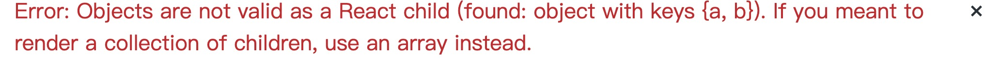
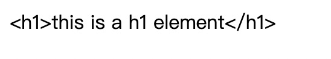

[toc]
# 1-1 React概述
> 官网：https://react.docschina.org/
## 1.什么是React
React是由**Facebook**研发的、用与**解决UI复杂度**的开源**JavaScript库**，目前由React联合社区维护。
> ⚠️ 它不是框架，只是为了解决UI复杂度而诞生的一个库

## 2.React的特点
- 轻量：React的开发版所有源码（包含注释）仅3000多行
- 原生：所有的React的代码都是用原生JS书写而成的，不依赖其他任何库
- 易扩展：React对代码的封装程度较低，也没有过多的使用魔法，所以React中的很多功能都可以扩展
- 不依赖宿主环境：React只依赖原生JS语言，不依赖任何其他东西，包括运行环境。因此，它可以被轻松的移植到浏览器、桌面应用、移动端。
- 渐进式：React并非框架，对整个工程没有强制约束力。这对与那些已经存在的工程，可以逐步的将其改造为React，而不需要全盘重写
- 单向数据流：所有的数据自顶而下的流动
- 用JS代码声明界面
- 组件化

## 3.对比VUE

|   对比项  |Vue|react|
| :----:   | :---: | :---:|
| 全球使用量 |       |   ✔️  |
| 国内使用量 |   ✔️   |      |
|   性能    |   ✔️   |   ✔️  |
|  易上手   |   ✔️    |     |
|  灵活度   |        |   ✔️  |
| 大型企业  |        |   ✔️  |
| 中小型企业 |   ✔️   |      |
|    生态   |       |   ✔️   |

## 4.学习路径
整体原则：熟悉API ➜ 深入理解原理
1. React
    - 基础：掌握React的基本使用方法，有能力制作各种组件，并理解其基本运作原理
    - 进阶：掌握React中的一些黑科技，提高代码质量
2. React-Router（相当于vue-router）
3. Redux：相当于VueX
    - Redux本身
    - 各种中间件
4. 第三方脚手架：umi
5. UI库：Ant Design，相当于Vue的Element-UI或IView
6. 源码部分
    - React源码分析
    - Redux源码分析

# 1-2 Hello World

☞引用：直接在页面上使用React，引用下面的JS
```html
<script crossorigin src="https://unpkg.com/react@16/umd/react.development.js"></script>
<script crossorigin src="https://unpkg.com/react-dom@16/umd/react-dom.development.js"></script>
<script src="https://unpkg.com/babel-standalone@6/babel.min.js"></script>
```
## 1.React.createElement
❇️ 创建一个React元素，称作虚拟DOM，本质上是一个对象
1. 参数1:元素类型，一般是字符串，一个普通的HTML元素
2. 参数2:元素的属性，一个对像
3. 后续参数：元素的子节点
```js
    var span = React.createElement(
        "span",
        {
          style: {
            color: "#fff",
            backgroundColor: "#f88",
          },
        },
        "一个span元素"
      );
    var h1 = React.createElement(
        "h1",
        {
          title: "第一个React元素",
        },
        "hello",
        "world",
        span
      );
```
## 2.JSX
⚠️ JS的扩展语法，需要使用babel进行转义

# 1-3 使用脚手架搭建工程
❇️ 官方：create-react-app
❇️ 第三方：next.js、umijs

> ⚠️ 凡是使用JSX的文件，必须导入React

# 1-4 开发环境
## 1.开发环境搭建

> https://reactnative.cn/docs/next/environment-setup
## 2.VSCode配置
❇️ emmet配置：

```json
"javascript": "javascriptreact"
```

## 3.VSCode插件安装

- ESLint：代码风格检查
- ES7 React/Redux/GraphQL/React-Native snippets：快速代码编写

## 4.Chrome插件安装

❇️ React Developer Tools

# 2-1 JSX
## 1.什么是JSX
- JSX是Facebook起草的JS扩展语法
- 本质是一个JS对象，会被babel编译，最终会被转换为React.CreateElement
- 每个JSX表达式，有且仅有一个根结点**React.Fragment**
- 根据XML规范，每个JSX元素必须结束

## 2.在JSX中嵌入表达式
- 在JSX中使用注释
``` javaScript
{/* 这是一个react注释 */}
```
- 将表达式作为内容的一部分
```js
//数字作为JSX的内容
{123}*{456} = {123*456}
//React对象作为JSX的内容
const Reactobj = <span>This is a span element</span>    //声明
{Reactobj}  //引用
//数组作为JSX的内容
const arr = [2,null,false,undefined,3];     //声明
{arr}       //引用
```
⚠️ null、undefined、false不会显示；
⚠️ 普通对象不可以作为子元素；
```js

const obj = {       //声明
  a:1,
  b:3
}
{obj}   //引用
```

⚠️ 可以放置React元素对象
- 将表达式作为元素属性
```js
import url from './noteImg/errorPic.jpg' //引入图片路径
 //JSX表达式作为元素属性
```
- 属性使用小驼峰命名法
- 防止注入攻击
‣ 自动编码
```js
const content = '<h1>This is a h1 element</h1>'
{content}
```
得到结果：

‣ dangerouslyStyleInnerHTML
```js
  <div dangerouslySetInnerHTML={{
    __html:content
  }}> 
  </div>
```
得到结果：


## 3.元素的不可变性
- 虽然JSX元素是一个对象，但是该对象中的所有属性不可更改
- 如果确实需要更改元素的属性，需要重新创建JSX元素

# 2-3 组件和组件属性
- 组件是包含内容、样式和功能的UI单元

## 1.创建一个组件
⚠️ 组件的名称首字母必须大写
### 函数组件
```js
import React from 'react'
export default function FuncComp(props) {
    //返回一个React元素
    return <div>这是第{props.number}个函数组件</div>
}
```
### 类组件
```js
import React from 'react'
//必须继承React.Component
export default class ClassComp extends React.Component {
    //必须提供render函数，用于渲染组件
    render(){
        return <div>这是第{this.props.number}个类组件</div>
    }
}
```
## 2.组件的属性
❇️ 对于函数组件，属性会作为一个对象的属性，传递给函数的参数
❇️ 对于类组件，属性会作为一个对象的属性，传递给构造函数的参数
⚠️ 组件名用大驼峰命名法，组件的属性用小驼峰命名法
⚠️ **组件无法改变自身的属性**

☞ 之前学习的React元素，本质上，就是一个组件（内置组件）
☞ React中的哲学：数据属于谁，谁才有权利改动
☞ **React中的数据，自顶而下流动**

# 2-5 组件状态
&emsp;&emsp;组件状态（state）：组件可以自行维护的数据，其仅在类组件中有效，本质上是类组件的一个属性，是一个对象。
⚠️ **状态的变化**
&emsp;&emsp;不能直接改变状态，因为React无法监控到状态发生了变化，必须使用this.setState({})改变状态
```js
this.setState({
    num: this.state.num - 1
})
```
⚠️ **组件中的数据**
1. props：该数据是由组件的使用者传递的数据，所有权不属于组件自身，因此组件无法改变数据；
2. state：该数据是由组件自身创建的，所有权属于组件自身，因此组件有权改变数据。