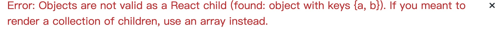
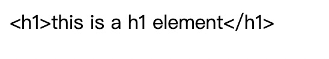

  
  
- [1-1 React概述](#1-1-react概述 )
  - [1.什么是React](#1什么是react )
  - [2.React的特点](#2react的特点 )
  - [3.对比VUE](#3对比vue )
  - [4.学习路径](#4学习路径 )
- [1-2 Hello World](#1-2-hello-world )
  - [1.React.createElement](#1reactcreateelement )
  - [2.JSX](#2jsx )
- [1-3 使用脚手架搭建工程](#1-3-使用脚手架搭建工程 )
- [1-4 开发环境](#1-4-开发环境 )
  - [1.开发环境搭建](#1开发环境搭建 )
  - [2.VSCode配置](#2vscode配置 )
  - [3.VSCode插件安装](#3vscode插件安装 )
  - [4.Chrome插件安装](#4chrome插件安装 )
- [2-1 JSX](#2-1-jsx )
  - [1.什么是JSX](#1什么是jsx )
  - [2.在JSX中嵌入表达式](#2在jsx中嵌入表达式 )
  - [3.元素的不可变性](#3元素的不可变性 )
- [2-3 组件和组件属性](#2-3-组件和组件属性 )
  - [1.创建一个组件](#1创建一个组件 )
    - [函数组件](#函数组件 )
    - [类组件](#类组件 )
  - [2.组件的属性](#2组件的属性 )
- [2-5 组件状态](#2-5-组件状态 )
- [2-7 事件](#2-7-事件 )
- [2-9 深入认识setState](#2-9-深入认识setstate )
- [2-10 生命周期](#2-10-生命周期 )
  - [1.旧版生命周期（React < 16.0.0）](#1旧版生命周期react-1600 )
    - [(1) constructor](#1-constructor )
    - [(2) componentWillMount](#2-componentwillmount )
    - [(3) **render**](#3-render )
    - [(4) **componentDidMount**](#4-componentdidmount )
    - [(5) 组件进入活跃状态](#5-组件进入活跃状态 )
    - [(6) componentWillReceiveProps](#6-componentwillreceiveprops )
    - [(7) **shoudComponentUpdate**](#7-shoudcomponentupdate )
    - [(8) componentWillUpdate](#8-componentwillupdate )
    - [(9) componentDidUpdate](#9-componentdidupdate )
    - [(10) componentWillUnmount](#10-componentwillunmount )
  - [2.新版生命周期(React ≥ 16.0.0)](#2新版生命周期react-1600 )
    - [(1) getDerivedStateFromProps](#1-getderivedstatefromprops )
    - [(2) getSnapshortBeforeUpdate](#2-getsnapshortbeforeupdate )
- [2-11 传递元素内容](#2-11-传递元素内容 )
  - [1.内置组件（div/h1/p）](#1内置组件divh1p )
  - [2.自定义组件传递元素内容](#2自定义组件传递元素内容 )
- [2-14 表单](#2-14-表单 )
- [3-1 属性默认值和类型检查](#3-1-属性默认值和类型检查 )
  - [1.属性默认值](#1属性默认值 )
  - [2.属性类型检查](#2属性类型检查 )
- [3-3 HOC(高阶组件)](#3-3-hoc高阶组件 )
  
#  1-1 React概述
  
> 官网：https://react.docschina.org/
##  1.什么是React
  
React是由**Facebook**研发的、用与**解决UI复杂度**的开源**JavaScript库**，目前由React联合社区维护。
> ⚠️ 它不是框架，只是为了解决UI复杂度而诞生的一个库
  
##  2.React的特点
  
- 轻量：React的开发版所有源码（包含注释）仅3000多行
- 原生：所有的React的代码都是用原生JS书写而成的，不依赖其他任何库
- 易扩展：React对代码的封装程度较低，也没有过多的使用魔法，所以React中的很多功能都可以扩展
- 不依赖宿主环境：React只依赖原生JS语言，不依赖任何其他东西，包括运行环境。因此，它可以被轻松的移植到浏览器、桌面应用、移动端。
- 渐进式：React并非框架，对整个工程没有强制约束力。这对与那些已经存在的工程，可以逐步的将其改造为React，而不需要全盘重写
- 单向数据流：所有的数据自顶而下的流动
- 用JS代码声明界面
- 组件化
  
##  3.对比VUE
  
  
|   对比项  |Vue|react|
| :----:   | :---: | :---:|
| 全球使用量 |       |   ✔️  |
| 国内使用量 |   ✔️   |      |
|   性能    |   ✔️   |   ✔️  |
|  易上手   |   ✔️    |     |
|  灵活度   |        |   ✔️  |
| 大型企业  |        |   ✔️  |
| 中小型企业 |   ✔️   |      |
|    生态   |       |   ✔️   |
  
##  4.学习路径
  
整体原则：熟悉API ➜ 深入理解原理
1. React
    - 基础：掌握React的基本使用方法，有能力制作各种组件，并理解其基本运作原理
    - 进阶：掌握React中的一些黑科技，提高代码质量
2. React-Router（相当于vue-router）
3. Redux：相当于VueX
    - Redux本身
    - 各种中间件
4. 第三方脚手架：umi
5. UI库：Ant Design，相当于Vue的Element-UI或IView
6. 源码部分
    - React源码分析
    - Redux源码分析
  
#  1-2 Hello World
  
  
☞引用：直接在页面上使用React，引用下面的JS
```html
<script crossorigin src="https://unpkg.com/react@16/umd/react.development.js"></script>
<script crossorigin src="https://unpkg.com/react-dom@16/umd/react-dom.development.js"></script>
<script src="https://unpkg.com/babel-standalone@6/babel.min.js"></script>
```
##  1.React.createElement
  
❇️ 创建一个React元素，称作虚拟DOM，本质上是一个对象
1. 参数1:元素类型，一般是字符串，一个普通的HTML元素
2. 参数2:元素的属性，一个对像
3. 后续参数：元素的子节点
```js
    var span = React.createElement(
        "span",
        {
          style: {
            color: "#fff",
            backgroundColor: "#f88",
          },
        },
        "一个span元素"
      );
    var h1 = React.createElement(
        "h1",
        {
          title: "第一个React元素",
        },
        "hello",
        "world",
        span
      );
```
##  2.JSX
  
⚠️ JS的扩展语法，需要使用babel进行转义
  
#  1-3 使用脚手架搭建工程
  
❇️ 官方：create-react-app
❇️ 第三方：next.js、umijs
  
> ⚠️ 凡是使用JSX的文件，必须导入React
  
#  1-4 开发环境
  
##  1.开发环境搭建
  
  
> https://reactnative.cn/docs/next/environment-setup
##  2.VSCode配置
  
❇️ emmet配置：
  
```json
"javascript": "javascriptreact"
```
  
##  3.VSCode插件安装
  
  
- ESLint：代码风格检查
- ES7 React/Redux/GraphQL/React-Native snippets：快速代码编写
  
##  4.Chrome插件安装
  
  
❇️ React Developer Tools
  
#  2-1 JSX
  
##  1.什么是JSX
  
- JSX是Facebook起草的JS扩展语法
- 本质是一个JS对象，会被babel编译，最终会被转换为React.CreateElement
- 每个JSX表达式，有且仅有一个根结点**React.Fragment**
- 根据XML规范，每个JSX元素必须结束
  
##  2.在JSX中嵌入表达式
  
- 在JSX中使用注释
``` javaScript
{/* 这是一个react注释 */}
```
- 将表达式作为内容的一部分
```js
//数字作为JSX的内容
{123}*{456} = {123*456}
//React对象作为JSX的内容
const Reactobj = <span>This is a span element</span>    //声明
{Reactobj}  //引用
//数组作为JSX的内容
const arr = [2,null,false,undefined,3];     //声明
{arr}       //引用
```
⚠️ null、undefined、false不会显示；
⚠️ 普通对象不可以作为子元素；
```js
  
const obj = {       //声明
  a:1,
  b:3
}
{obj}   //引用
```

⚠️ 可以放置React元素对象
- 将表达式作为元素属性
```js
import url from './noteImg/errorPic.jpg' //引入图片路径
 //JSX表达式作为元素属性
```
- 属性使用小驼峰命名法
- 防止注入攻击
‣ 自动编码
```js
const content = '<h1>This is a h1 element</h1>'
{content}
```
得到结果：

‣ dangerouslyStyleInnerHTML
```js
  <div dangerouslySetInnerHTML={{
    __html:content
  }}> 
  </div>
```
得到结果：

  
##  3.元素的不可变性
  
- 虽然JSX元素是一个对象，但是该对象中的所有属性不可更改
- 如果确实需要更改元素的属性，需要重新创建JSX元素
  
#  2-3 组件和组件属性
  
- 组件是包含内容、样式和功能的UI单元
  
##  1.创建一个组件
  
⚠️ 组件的名称首字母必须大写
###  函数组件
  
```js
import React from 'react'
export default function FuncComp(props) {
    //返回一个React元素
    return <div>这是第{props.number}个函数组件</div>
}
```
###  类组件
  
```js
import React from 'react'
//必须继承React.Component
export default class ClassComp extends React.Component {
    //必须提供render函数，用于渲染组件
    render(){
        return <div>这是第{this.props.number}个类组件</div>
    }
}
```
##  2.组件的属性
  
❇️ 对于函数组件，属性会作为一个对象的属性，传递给函数的参数
❇️ 对于类组件，属性会作为一个对象的属性，传递给构造函数的参数
⚠️ 组件名用大驼峰命名法，组件的属性用小驼峰命名法
⚠️ **组件无法改变自身的属性**
  
☞ 之前学习的React元素，本质上，就是一个组件（内置组件）
☞ React中的哲学：数据属于谁，谁才有权利改动
☞ **React中的数据，自顶而下流动**
  
#  2-5 组件状态
  
&emsp;&emsp;组件状态（state）：组件可以自行维护的数据，其仅在类组件中有效，本质上是类组件的一个属性，是一个对象。
⚠️ **状态的变化**
&emsp;&emsp;不能直接改变状态，因为React无法监控到状态发生了变化，必须使用this.setState({})改变状态
```js
this.setState({
    num: this.state.num - 1
})
```
⚠️ **组件中的数据**
1. props：该数据是由组件的使用者传递的数据，所有权不属于组件自身，因此组件无法改变数据；
2. state：该数据是由组件自身创建的，所有权属于组件自身，因此组件有权改变数据。
  
#  2-7 事件
  
&emsp;&emsp;在React中，组件的事件，本质上就是一个属性，按照之前React对组件的约定，由于事件本质上是一个属性，因此也需要使用小驼峰命名法
⚠️ **如果没有特殊处理，在事件处理函数中，this指向undefined**
**解决：**
（1） 使用bind函数，绑定this；
（2）使用箭头函数
  
#  2-9 深入认识setState
  
&emsp;&emsp;setState对状态的改变，可能是异步的
⚠️ 如果改变状态的代码处于某个HTML元素的事件中，则其代码是异步的，否则是同步的；如果遇到某个事件中，需要同步调用多次，需要使用函数的方式得到最新状态。
```js
this.setState({
    n: this.state.n + 1,
},()=>{
    console.log('回调：',this.state.n)   //状态完成改变之后触发，该回调运行在render之后
})
```
**最佳实践**
（1）把所有的setState当作是异步的，永远不要信任setState调用之后的状态
（2）如果要使用改变之后的状态，需要使用回调函数，即setSate的第二个参数
（3）如果新的状态要根据之前的状态进行运算，使用函数的方式改变状态（setState的第一个参数）
```js
this.setState(cur => {
    return {
        n: cur.n + 1
    }
})
```
⚠️ React会对异步的setState进行优化，将多次setState进行合并（将多次状态改变完成后，再统一对state进行改变，然后触发render）
```js
handleClick = () => {
    this.setState(cur => {
        return {
            n: cur.n + 1
        }
    }, () => {
        console.log('callback:', this.state.n)
    })
    this.setState(cur => {
        return {
            n: cur.n + 1
        }
    })
    this.setState(cur => {
        return {
            n: cur.n + 1
        }
    })
}
```
  
#  2-10 生命周期
  
  
&emsp;&emsp;定义：生命周期指组件从诞生到销毁会经历的过程。React在组件的声明周期中提供了一系列的钩子函数（类似于事件），可以让开发者在函数中注入代码，这些代码会在适当的时候运行
⚠️ 生命周期仅存在于类组件中，函数组件每次调用都是重新运行函数，旧的组件即刻被销毁
##   1.旧版生命周期（React < 16.0.0）
  
###  (1) constructor
  
- 同一个组件对象只会创建一次
- 不能在第一次挂载到页面之前调用setState，为了避免问题，构造函数中严禁使用setState
###  (2) componentWillMount
  
- 正常情况下，和构造函数一样只会运行一次
- 可以使用setState,但是为了避免bug，不允许使用，因为在某些特殊情况下，该函数可能被调用多次
###  (3) **render**
  
- 返回一个虚拟DOM，会被挂载到虚拟DOM树中，最终被渲染到页面的真实DOM中
- render可能不止运行一次，只要需要重新渲染，就会重新运行
- 严禁使用setState，因为可能会导致无限递归渲染
###  (4) **componentDidMount**
  
- 只会执行一侧
- 可以使用setState
- 通常情况下，会将网络请求、启动计时器等一开始需要的操作，书写到该函数中
###  (5) 组件进入活跃状态
  
###  (6) componentWillReceiveProps
  
- 即将接收新的属性值
- 参数为新的属性对象
⚠️ 该函数可能会导致一些bug，所以**不推荐使用**
###  (7) **shoudComponentUpdate**
  
- 指示React是否要重新渲染该组件，通过返回true和false来指定
- 默认情况下，会直接返回true
###  (8) componentWillUpdate
  
&emsp;组件即将被重新渲染
###  (9) componentDidUpdate
  
&emsp;通常在该函数中使用DOM操作，改变元素
###  (10) componentWillUnmount
  
&emsp;通常在该函数中销毁一些组件依赖的资源，比如定时器
  
##  2.新版生命周期(React ≥ 16.0.0)
  
&emsp;React官方认为，某个数据的来源必须是单一的
###  (1) getDerivedStateFromProps
  
- 通过参数可以获取新的属性和状态
- 该函数是静态的
- 该函数的返回值会覆盖掉组状态
- **该函数几乎是没有什么用**
###  (2) getSnapshortBeforeUpdate
  
- 真实的DOM构建完成，但还未实际渲染到页面中
- 在该函数中，通常用于实现一些附加的dom操作
- 该函数的返回值，会作为componentDidUpdate的第三个参数
  
#  2-11 传递元素内容
  
##  1.内置组件（div/h1/p）
  
```html
<div>
    This is a div element   <!-- 传递的内容 -->
</div>
```
##  2.自定义组件传递元素内容
  
&emsp;&emsp;如果给自定义组件传递元素内容，则React会将元素内容作为children属性传递过去
```html
<Comp>
    {content1}
    {content2}
    {content3}
</Comp>
```
打印组件的children属性如下

  
#  2-14 表单
  
- 受控组件
    组件的使用者，有能力完全控制该组件的行为和内容，通常情况下，受控组件往往没有自身的状态，其内容也完全受到属性的控制
- 非受控组件
    组件的使用者，没有能力控制该组件的行为和内容，组件的行为和内容完全自行控制
  
⚠️ **表单组件**默认情况下是非受控组件，一旦设置了组件的value属性，则其变为受控组件（单选和多选框需要设置checked）
  
#  3-1 属性默认值和类型检查
  
##  1.属性默认值
  
&emsp;&emsp;通过一个静态属性**defaultProps**告知react属性默认值
```js
export default class ClassDefault extends Component {
    //类组件的默认属性
    static defaultProps ={
        a:10,
        b:20
    }
    render() {
        return (
            <div>
                a:{this.props.a}
                b:{this.props.b}
            </div>
        )
    }
}
```
```js
export default function FunctionDefault(props) {
    return (
        <div>
            a:{props.a}
            b:{props.b}
        </div>
    )
}
//函数组件啊的默认属性
FunctionDefault.defaultProps={
    a:10,
    b:20
}
```
##  2.属性类型检查
  
📍 使用库：**prop-types**
使用方法：使用**propTypes**静态属性告知react如何检查属性
```js
static propTypes = {
        a: PropTypes.number.isRequired,             //要求a必须是数字，并且为必填项
    }
```
⚠️ 常用类型检查
```js
  
PropTypes.any：//任意类型
PropTypes.array：//数组类型
PropTypes.bool：//布尔类型
PropTypes.func：//函数类型
PropTypes.number：//数字类型
PropTypes.object：//对象类型
PropTypes.string：//字符串类型
PropTypes.symbol：//符号类型
  
PropTypes.node：//任何可以被渲染的内容，字符串、数字、React元素
PropTypes.element：//react元素
PropTypes.elementType：//react元素类型
PropTypes.instanceOf(构造函数)：//必须是指定构造函数的实例
PropTypes.oneOf([xxx, xxx])：//枚举
PropTypes.oneOfType([xxx, xxx]);  //属性类型必须是数组中的其中一个
PropTypes.arrayOf(PropTypes.XXX)：//必须是某一类型组成的数组
PropTypes.objectOf(PropTypes.XXX)：//对象由某一类型的值组成
PropTypes.shape(对象): //属性必须是对象，并且满足指定的对象要求
PropTypes.exact({...})：//对象必须精确匹配传递的数据
//自定义属性检查，如果有错误，返回错误对象即可
属性: function(props, propName, componentName) {
   //...
}
```
  
#  3-3 HOC(高阶组件)
  
- HOF: Higher-Order Function,高阶函数，以函数作为参数，并返回一个函数
- HOC: Higher-Order Component,高阶组件，以组件作为参数，并返回一个组件
  
⚠️ **通常可以利用HOC实现横切关注点**
📍 例：20个组件，每个组件在创建组件和销毁组件时，都需要作日志记录
  
⚠️ 不要在render中使用高阶组件
不要在高阶组件内部更改传入的组件
  